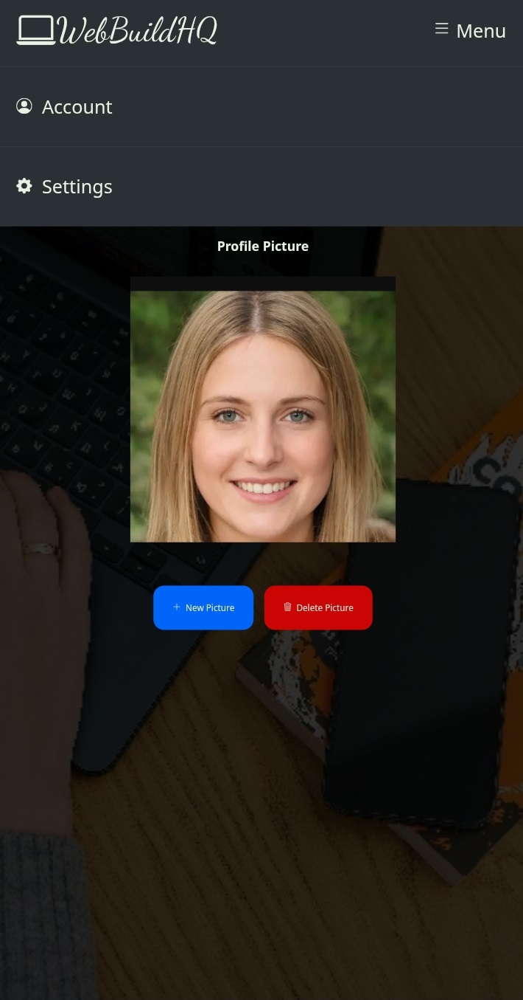
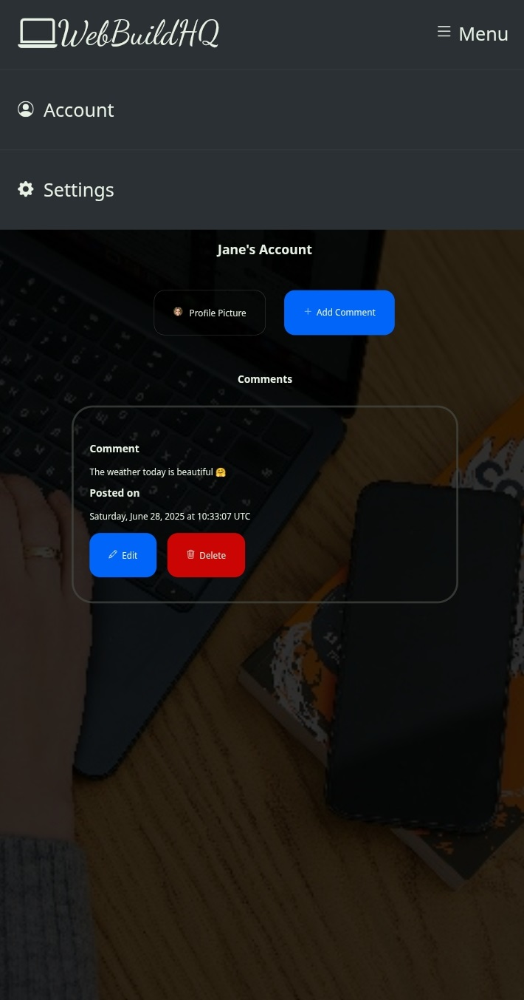
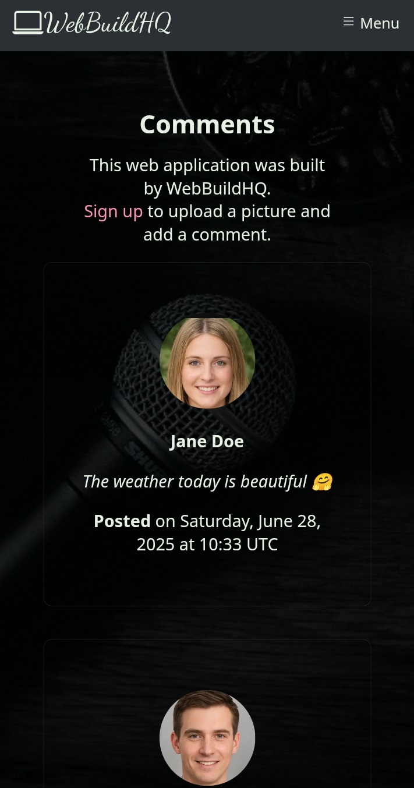

# WebBuildHQ
An application where you can add 
pictures and comments to.

## About
WebBuildHQ is an application where you
can add comments and pictures to, it
was built with Python, the server
that communicates with the users
was built with Flask, the database
where users' information(like emails,
comments e.t.c.) are stored was built
with SQLAlchemy, for the user-side,
the structure was built with HTML,
appearance was made using CSS styling
(the icons and some of the buttons'
colors were gotten from Bootstrap) and the
animation was done with 
JavaScript and jQuery,
the colors were gotten from 
Color Hunt and
fonts were gotten from 
Google Fonts. 
The application is run from the 
"main.py" file.

## How to use the app
**Step 1**
Visit the homepage 
https://webbuildhq.onrender.com, you 
should see a webpage that looks like this:

**Step 2**
Sign up or login, after signing up or 
logging in, you should be redirected to 
your 'Account' page which looks like this:

**Step 3**
Click on the 'Profile Picture' button, 
then click on 'Add a profile picture' and 
upload your picture, then your picture 
should display on your 'Profile Picture' 
page like this:

Done! Now you can navigate back to 
your 'Account' page.

**Step 4**
On your 'Account' page, click on 
the 'Add comment' button, add 
your comment and click the 'Submit' 
button, you should be redirected to 
your 'Account' page with your comment and 
the date and time it was made showing up 
on your dashboard, your 'Account' page 
should look like this:

You can add as many comments as you want! 
Your comment should also show up on 
the 'Comments' page, which you can 
navigate to by clicking the 'Menu' button, 
then clicking the 'Comments' button, the 
'Comments' page looks like this:

